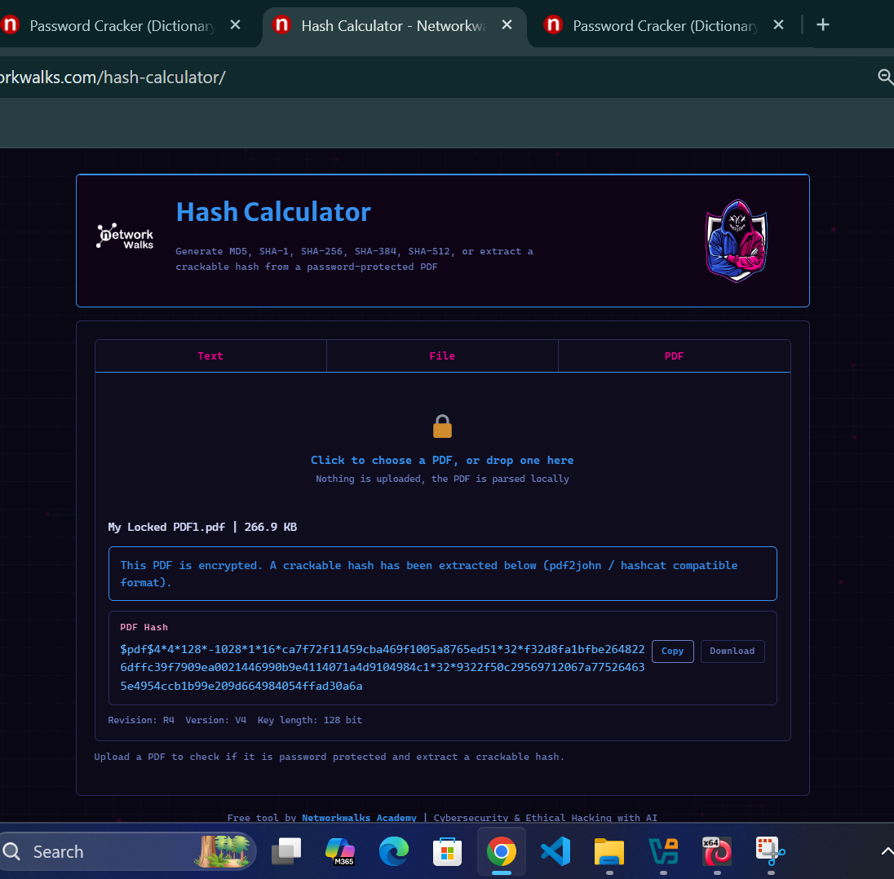
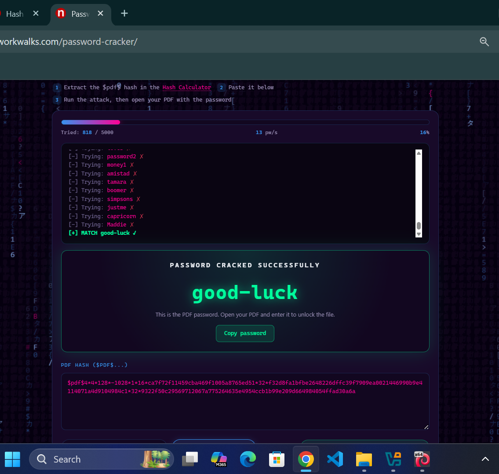
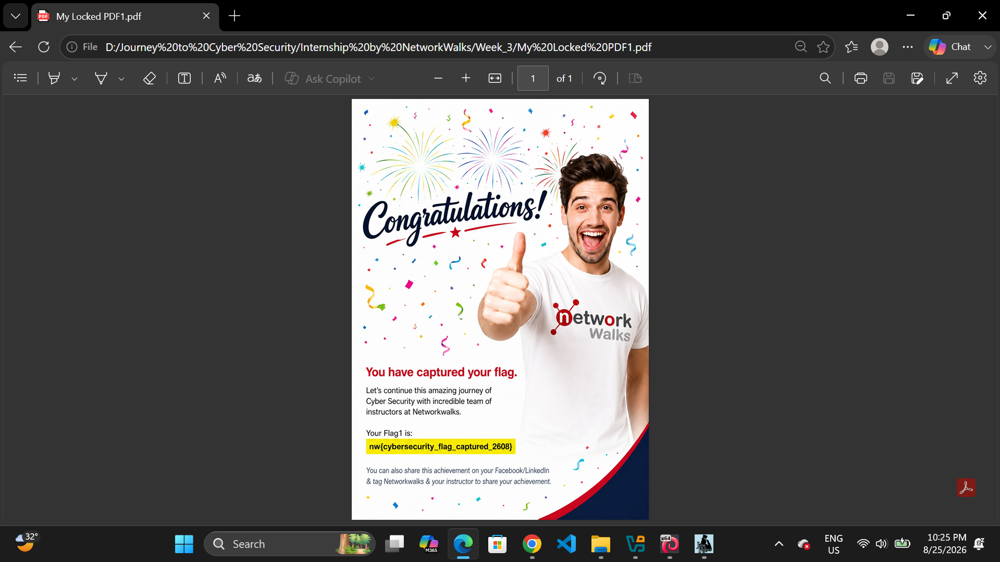
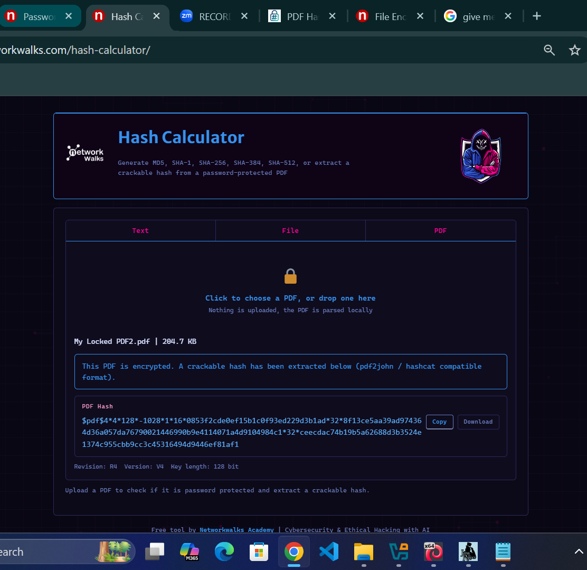
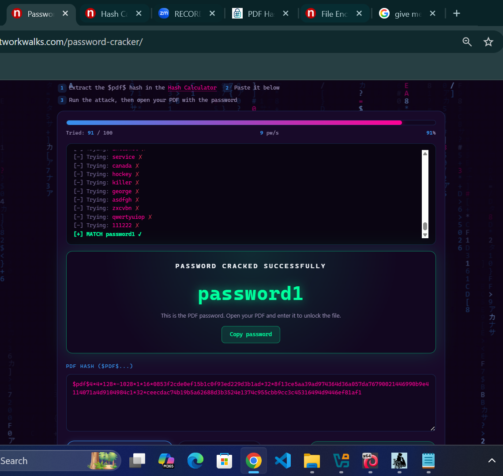
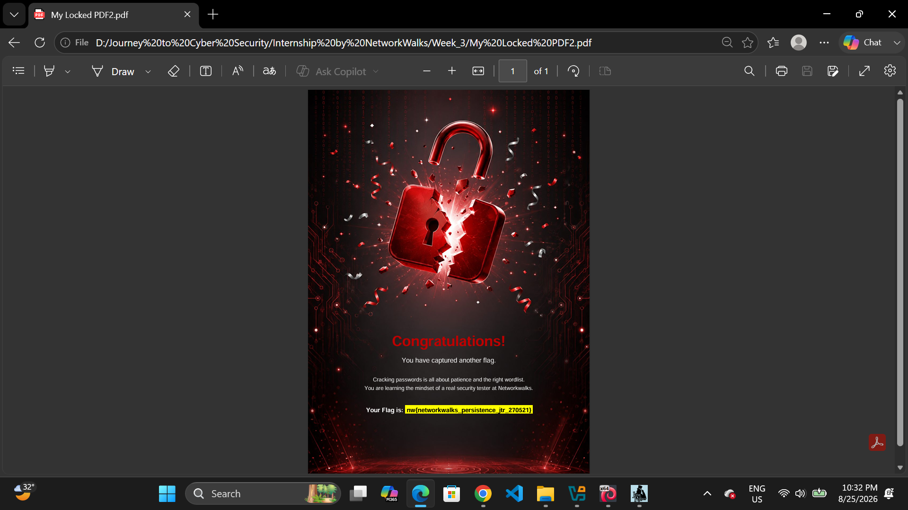
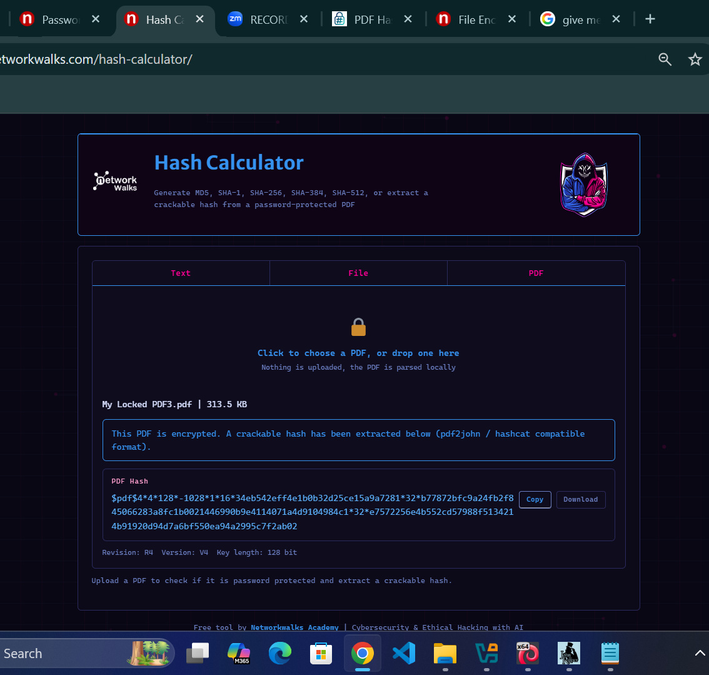
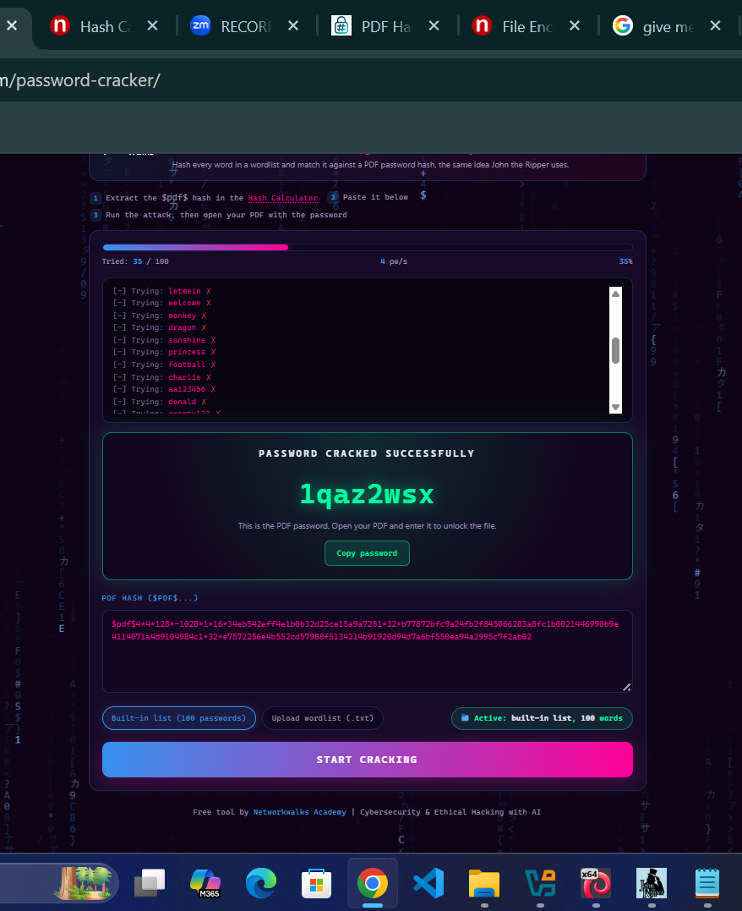
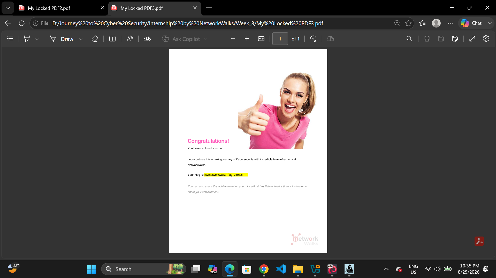

# 🛡️ Browser-Based Password Cracking & Hash Analysis with Networkwalks Tools (W3-PM2)


-orange.svg)

---

## 📌 Executive Summary
Password cracking represents Phase 3 (Gaining Access / System Exploitation) of the penetration testing lifecycle. In this practical lab module, client-side, browser-based cryptographic utilities—specifically the **Networkwalks Hash Calculator** and **Networkwalks Dictionary Password Cracker**—were utilized to extract encryption hashes from locked PDF documents and recover plaintext passwords using automated wordlist attacks.

During this assessment, custom dictionary engineering was applied after default built-in wordlists were exhausted, demonstrating why password length, complexity, and unique character entropy are vital for access control.

---

## ⚙️ Target & Environment Scope
* **Pentester / Author:** Faheem Ali Wattoo
* **Program:** Networkwalks Cybersecurity & Ethical Hacking Internship
* **Batch Code:** B082-Networkwalks
* **Target Files:** Encrypted PDF Documents (`My Locked PDF1.pdf`, `My Locked PDF2.pdf`, `My Locked PDF3.pdf`)
* **Testing Platform:** Windows 11 Host / Chromium Browser
* **Tools Used:** 
  * Networkwalks Hash Calculator (`https://networkwalks.com/hash-calculator/`)
  * Networkwalks Password Cracker (`https://networkwalks.com/password-cracker/`)
  * Custom Dictionary (`custom_wordlist.txt` based on Nmap and expanded candidate wordlists)
  * Edge / Acrobat PDF Viewer for Flag Decryption Verification

---

## 🧰 Tools & Reconnaissance Matrix

| Tool / Utility | Role | Functionality Executed |
| :--- | :--- | :--- |
| **NW Hash Calculator** | Cryptographic Hash Extractor | Parsed client-side binary PDF headers into crackable `$pdf$` hash format |
| **NW Password Cracker (Default List)** | Standard Wordlist Engine | Automated trial against top 100 common passwords |
| **NW Password Cracker (Custom Upload)** | Expanded Dictionary Attack | Evaluated custom wordlist containing extended Nmap terms and targeted phrases |
| **PDF Viewer / Browser** | Flag Validation | Authenticated using recovered passwords to verify flag capture |

---

## 🔬 Hands-on Technical Activities & Verification

### 🔹 Activity 1: Target PDF 1 (Hash Extraction, Custom Dictionary & Flag Discovery)

* **Step 1: Hash Extraction**
  * Uploaded `My Locked PDF1.pdf` (266.9 KB) to the **Networkwalks Hash Calculator**.
  * Extracted Standard `$pdf$` Hash:
    ```text
    $pdf$4*4*128*-1028*1*16*ca7f72f11459cba469f1005a8765ed51*32*f32d8fa1bfbe2648226dffc39f7909ea0021446990b9e4114071a4d9104984c1*32*9322f50c29569712067a775264635e4954ccb1b99e209d664984054ffad30a6a
    ```



* **Step 2: Dictionary Expansion & Password Recovery**
  * The initial attack using the default built-in list (100 passwords) did not yield a match because the passphrase was not present in the top-100 baseline.
  * **Troubleshooting & Wordlist Optimization:** Prepared and uploaded a custom dictionary (`custom_wordlist.txt`) combining standard Nmap password lists and supplementary candidate terms.
  * Executed the attack across the expanded list:
    * **Progress:** Match identified at candidate 818 / 5000 (13 pw/s)
    * **Cracked Plaintext Password:** `good-luck`



* **Step 3: Verification & Flag Capture**
  * Authenticated to `My Locked PDF1.pdf` using `good-luck`.
  * **Captured Flag:** `nw{cybersecurity_flag_captured_2608}`



---

### 🔹 Activity 2: Target PDF 2 (Hash Extraction & Password Recovery)

* **Step 1: Hash Extraction**
  * Uploaded `My Locked PDF2.pdf` (204.7 KB) to the Hash Calculator.
  * Extracted Standard `$pdf$` Hash:
    ```text
    $pdf$4*4*128*-1028*1*16*0853f2cde0ef15b1c0f93ed229d3b1ad*32*8f13ce5aa39ad974364d36a057da76790021446990b9e4114071a4d9104984c1*32*ceecdac74b19b5a62688d3b3524e1374c955cbb9cc3c45316494d9446ef81af1
    ```



* **Step 2: Password Recovery**
  * Loaded hash into Networkwalks Password Cracker.
  * **Progress:** Match identified at trial 91 / 100 (9 pw/s) using the built-in list.
  * **Cracked Plaintext Password:** `password1`



* **Step 3: Verification & Flag Capture**
  * Authenticated to `My Locked PDF2.pdf` using `password1`.
  * **Captured Flag:** `nw{networkwalks_persistence_jtr_270521}`



---

### 🔹 Activity 3: Target PDF 3 (Hash Extraction & Password Recovery)

* **Step 1: Hash Extraction**
  * Uploaded `My Locked PDF3.pdf` (313.5 KB) to the Hash Calculator.
  * Extracted Standard `$pdf$` Hash:
    ```text
    $pdf$4*4*128*-1028*1*16*34eb542eff4e1b0b32d25ce15a9a7281*32*b77872bfc9a24fb2f845066283a8fc1b0021446990b9e4114071a4d9104984c1*32*e7572256e4b552cd57988f5134214b91920d94d7a6bf550ea94a2995c7f2ab02
    ```



* **Step 2: Password Recovery**
  * Loaded hash into Networkwalks Password Cracker.
  * **Progress:** Match identified at trial 35 / 100 (4 pw/s) using the built-in list.
  * **Cracked Plaintext Password:** `1qaz2wsx`



* **Step 3: Verification & Flag Capture**
  * Authenticated to `My Locked PDF3.pdf` using `1qaz2wsx`.
  * **Captured Flag:** `nw{networkwalks_flag_260821_1}`



---

## 📊 Summary of Recovered Credentials & Flags

| Target Asset | Extracted Hash Prefix | Recovered Password | Attack Method / Wordlist | Captured Flag |
| :--- | :--- | :--- | :--- | :--- |
| **My Locked PDF1.pdf** | `$pdf$4*4*128*...` | `good-luck` | Custom Wordlist (`custom_wordlist.txt`) | `nw{cybersecurity_flag_captured_2608}` |
| **My Locked PDF2.pdf** | `$pdf$4*4*128*...` | `password1` | Built-in Top 100 Wordlist | `nw{networkwalks_persistence_jtr_270521}` |
| **My Locked PDF3.pdf** | `$pdf$4*4*128*...` | `1qaz2wsx` | Built-in Top 100 Wordlist | `nw{networkwalks_flag_260821_1}` |

---

## 🧠 Cryptographic & Offensive Security Insights

### 1. Two-Way Encryption vs. One-Way Hashing
* **Encryption:** Reversible mathematical transformation requiring a symmetric/asymmetric key to decrypt back to plaintext.
* **Hashing:** Irreversible one-way cryptographic digest. Password recovery against hashes operates by computing hashes for candidate words and comparing outputs until an exact digest match occurs.

### 2. Wordlist Engineering & Keyboard Pattern Weaknesses
* Standard password defaults (`password1`) and simple keyboard walk patterns (`1qaz2wsx`) appear in top-tier wordlists, rendering them vulnerable to sub-second cracking.
* Hyphenated words or phrases (`good-luck`) resist basic top-100 lists but remain susceptible once attackers deploy domain-specific or merged wordlists.

---

## 🛡️ Defensive Hardening Guidelines

* **Enforce Complex Passphrases:** Mandate minimum 16-character passphrases combining uppercase, lowercase, numeric digits, and non-alphanumeric symbols.
* **Deprecate Legacy PDF Encryption:** Avoid using legacy 40-bit/128-bit RC4 encryption handlers; enforce AES-256 (Revision 6) encryption standards.
* **Audit Against Common Wordlists:** Periodically run corporate credentials and document stores against public dictionaries (e.g., SecLists, RockYou) to eliminate predictable phrases.

---

## 👨‍💻 Author / Pentester Details
* **Pentester Name:** Faheem Ali Wattoo
* **Program:** Networkwalks Cybersecurity & Ethical Hacking Internship
* **Batch:** B082-Networkwalks
* **Lead Instructor:** [Waqas Karim CCIE](https://www.linkedin.com/in/waqaskarim/)
